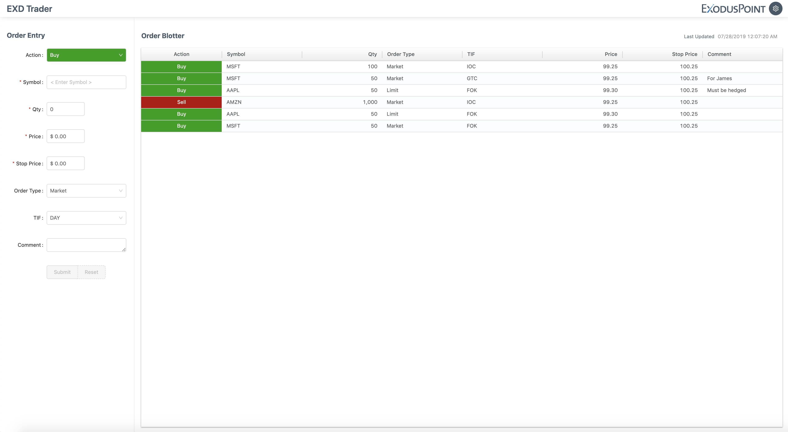
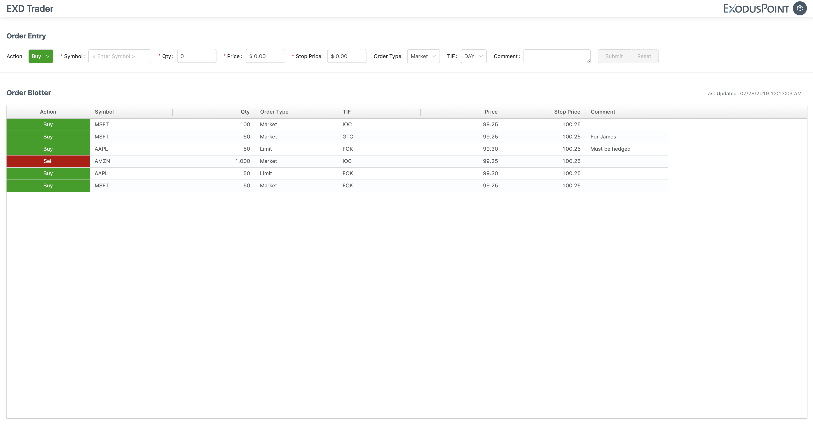

# order-entry
order entry coding challenge

#### Start Project
```
npm i && npm start
```

#### Host:Port
```
localhost:8080
```

#### Vertical Layout - Screenshot


#### Horizontal Layout - Screenshot


# note

There is a bug in the latest version of antd; it requires css-animation@^1.5.0; the latest version of that is 1.6.0 and they introduced file name changes. Because of that, I added css-animation@1.5.0 in the package.json

```
// node_modules/antd/es/_util/wave.js

import TransitionEvents from "css-animation/es/Event";
```
